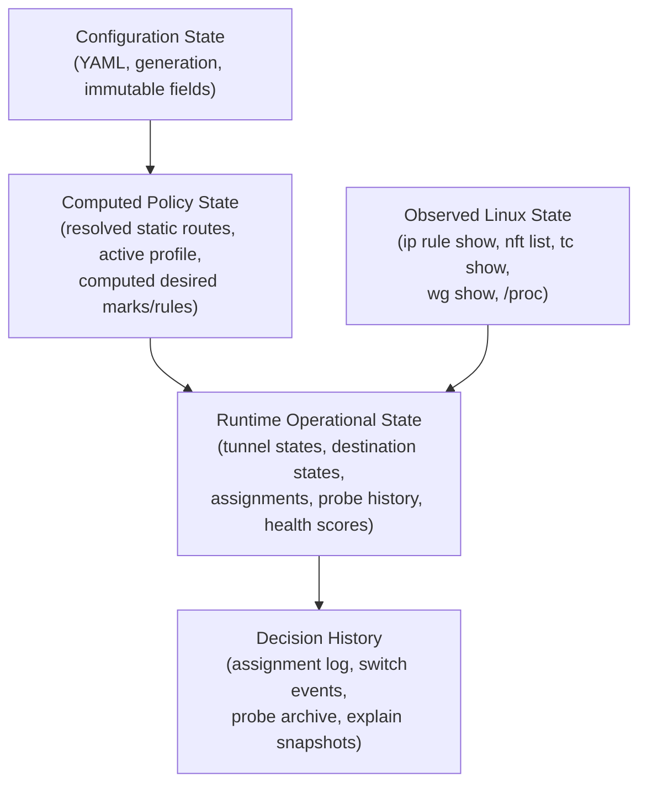
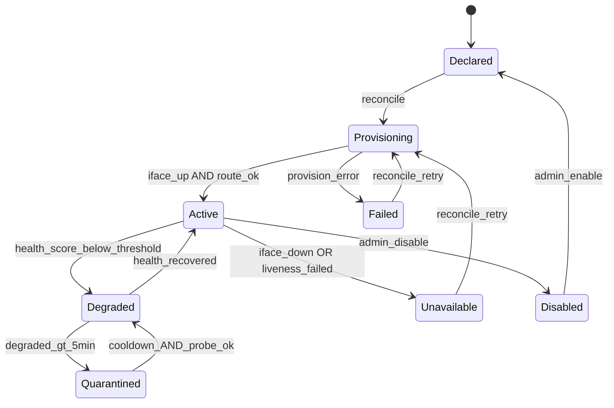
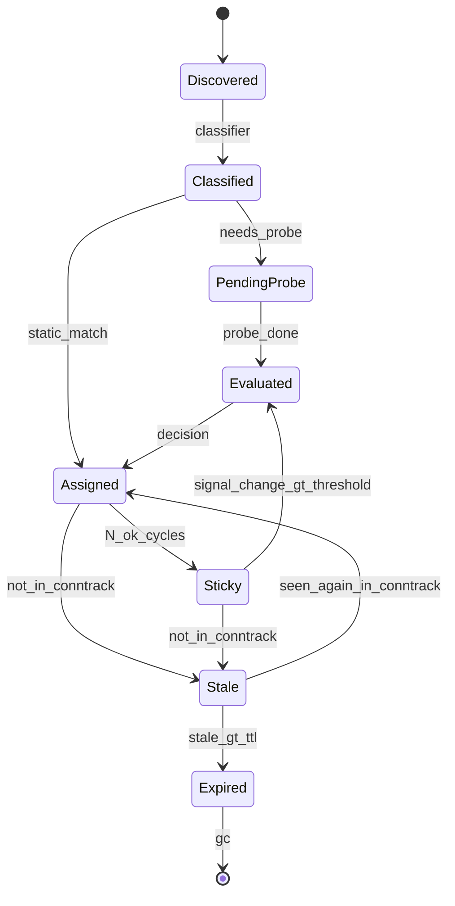
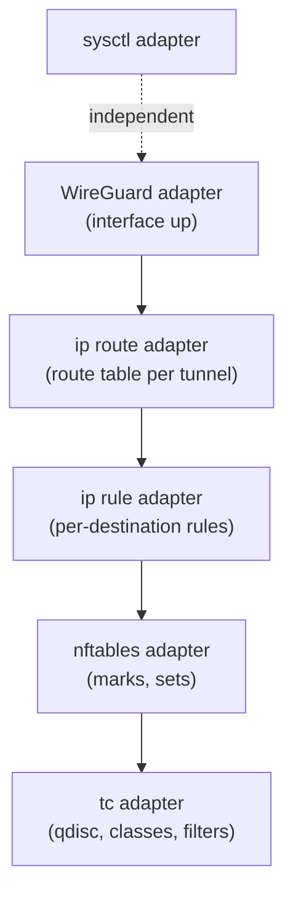
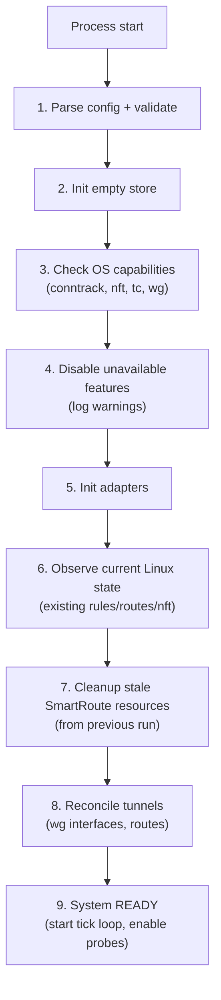

# SmartRoute — операционная сетевая система на Go

---

## 1. Архитектурные принципы

- **Desired state -> reconcile -> observe.** Система непрерывно сближает наблюдаемое состояние с желаемым. Не "выполняет команды".
- **Идемпотентность.** Любое сетевое изменение можно применить повторно без побочных эффектов.
- **Объяснимость.** Каждое runtime-решение объяснимо через `explain` в стабильном формате.
- **Изоляция отказов.** Деградация компонента не ломает dataplane. Система продолжает с оставшимися ресурсами.
- **Стабильность над отзывчивостью.** Предпочтение удержанию текущего assignment. Переключение требует устойчивого сигнала. Для разных traffic class — разный баланс (game: быстрее; bulk: стабильнее).
- **Границы ответственности.** SmartRoute управляет только явно объявленными ресурсами. Всё остальное не трогается.
- **Модульные контракты.** Каждый внутренний модуль имеет явный интерфейс. Observer никогда не изменяет систему. Adapter никогда не принимает решение. Engine не знает деталей Linux-команд. Domain и decision не импортируют `os`/`exec`.

---

## 2. Нецели

SmartRoute **не является и не стремится быть**:

- Полноценным L7 proxy или DPI-системой.
- Mesh/SD-WAN controller.
- Системой миграции active TCP flows.
- Менеджером удалённых VPS после bootstrap (gen-remote — convenience tool, не orchestrator).
- Решением multi-tenant isolation.
- Гарантией application-layer success (маршрут выбран, но приложение может всё равно получить ошибку).
- Deep packet inspection beyond limited signals (SNI, DNS cache, port heuristic).
- Универсальным installer для всех Linux-дистрибутивов.

Масштаб: до 10 туннелей, до 500 destinations, 1 client subnet. Это инструмент для персональной или small-team VPN-маршрутизации.

---

## 3. Разделение плоскостей и модульные контракты

```mermaid
graph LR
    subgraph control_plane ["Control Plane"]
        ConfigMgr["Config Manager"]
        DecisionEng["Decision Engine"]
        Reconciler["Reconciler"]
        PolicyStack["Policy Stack"]
        HealthMgr["Health Manager"]
    end

    subgraph data_plane ["Data Plane Hooks"]
        WGIface["WireGuard adapter"]
        IPRoute["ip route adapter"]
        IPRule["ip rule adapter"]
        NFTables["nftables adapter"]
        TC["tc adapter"]
        SysctlAdp["sysctl adapter"]
    end

    subgraph observe_plane ["Observation Plane"]
        ConntrackObs["Conntrack Observer"]
        PassiveSignals["Passive Signals"]
        ProbeSubsys["Probe Subsystem"]
        EventBus["Event Bus"]
        MemLog["MemLog Ring"]
        StatusAPI["CLI Status/Explain"]
    end

    observe_plane -->|"signals, destinations, health"| control_plane
    control_plane -->|"desired state"| data_plane
    data_plane -->|"observed state"| control_plane
```




### Контракты модулей

Каждый adapter реализует:

```go
type Reconcilable interface {
    Desired(cfg *Config, decisions *DecisionSet) State
    Observe() (State, error)
    Plan(desired, observed State) Diff
    Apply(diff Diff) error
    Verify(desired State) error
    Cleanup() error
}
```

**Жёсткие инварианты:**

- `observer/`* — только чтение. Никогда не вызывает `exec.Command` с мутирующими аргументами.
- `adapter/`* — только применение. Не принимает решений, не хранит domain state.
- `decision/`* — только логика. Не импортирует `os`, `exec`, `syscall`.
- `domain/`* — только модели. Не импортирует ничего кроме stdlib types (`net.IP`, `time.Time`).
- `engine/`* — оркестрация. Знает контракты модулей, не знает деталей реализации.

---

## 4. Слои состояния




| Слой            | Source of truth                        | Кто обновляет                       | TTL                                             |
| --------------- | -------------------------------------- | ----------------------------------- | ----------------------------------------------- |
| Configuration   | YAML-файл на диске                     | Config Manager (при старте, SIGHUP) | До следующего reload                            |
| Computed Policy | Вычисляется из config + active profile | Engine при каждом reload            | До следующего reload                            |
| Runtime         | Store (in-memory)                      | Engine tick loop                    | Continuous; GC по TTL                           |
| Observed Linux  | Linux kernel                           | Adapters при каждом reconcile       | Мгновенный snapshot; не кэшируется между тиками |
| History         | Store (in-memory, ring)                | Engine после каждого решения        | Кольцевой; старые затираются                    |


### Source of truth при конфликте

- **Observed Linux всегда актуальнее store.** Если observed отличается от store (кто-то руками удалил rule), reconciler сравнивает observed с desired (из policy), а не со store.
- **Store — canonical runtime state**, но не кэш Linux. Store хранит domain-level состояние (tunnel health score, destination assignment, probe history). Linux state читается заново при каждом reconcile.
- **Explain работает по store** (последнее решение). Если observed уже изменился с момента решения, explain показывает `(stale: observed may differ)`.

---

## 5. Формальная модель сущностей

### Tunnel

```go
type Tunnel struct {
    Name        string
    Endpoint    string
    Interface   string
    RouteTable  int
    FWMark      uint32
    IsDefault   bool
    State       TunnelState
    Health      TunnelHealth
}

type TunnelHealth struct {
    Liveness     LivenessStatus  // up | down | unknown
    Performance  PerformanceStatus // good | degraded | poor
    Score        float64         // 0.0 (dead) - 1.0 (perfect)
    PenaltyMs    int             // штраф к latency для scoring
    LastCheck    time.Time
    DegradedAt   time.Time       // zero if not degraded
}
```

### Destination

```go
type Destination struct {
    IP          net.IP
    Port        uint16
    Proto       uint8
    Domain      string
    DomainConf  float64        // 0.0-1.0
    Class       TrafficClass
    State       DestState
    Assignment  *Assignment
    LastSeen    time.Time
    FirstSeen   time.Time
}
```

### Assignment

```go
type Assignment struct {
    DestIP        net.IP
    TunnelName    string
    Reason        AssignmentReason
    PolicyLevel   int             // какой уровень policy stack решил
    Signals       []Signal
    Score         float64         // итоговый score выбранного туннеля
    RejectedWith  []RejectedCandidate // почему не выбраны другие
    Generation    uint64
    CreatedAt     time.Time
    StickyCount   int             // кол-во успешных циклов подряд
    IsSticky      bool
}

type RejectedCandidate struct {
    TunnelName string
    Score      float64
    Reason     string  // "excluded:unavailable", "excluded:http_403", "lost:hysteresis", etc.
}
```

### ProbeResult

```go
type ProbeResult struct {
    DestIP     net.IP
    Tunnel     string
    Type       ProbeType
    LatencyMs  int
    StatusCode int         // HTTP code or 0
    ErrorClass ErrorClass  // none | timeout | conn_refused | tls_error | http_client_error | http_server_error | unknown
    Confidence float64
    Timestamp  time.Time
}
```

### TrafficClass, RuntimeProfile, Signal — см. соответствующие разделы ниже.

---

## 6. State machines

### Tunnel




### Destination




### Quarantine impact на assigned destinations

Когда tunnel переходит в `quarantined`:

1. Все destinations с `assignment.tunnel == quarantined_tunnel` получают **force re-evaluate** в текущем тике.
2. Re-evaluate использует оставшихся healthy кандидатов.
3. Активные TCP-сессии через quarantined tunnel продолжают работать (conntrack); новые flows идут через новый tunnel.
4. Если quarantined tunnel — единственный кандидат для static route destination, destination переходит в `degraded` assignment с логом WARNING (static override сильнее quarantine, но ситуация логируется).

---

## 7. Decision framework

### Scoring model

Для каждой пары (destination, tunnel) вычисляется score:

```
base_score = 1000 - latency_ms
health_adj = base_score * tunnel.health.score
penalty_adj = health_adj - tunnel.health.penalty_ms
negative_adj = penalty_adj * negative_signal_factor(dest, tunnel)
sticky_adj = negative_adj + (sticky_bonus if current_assignment)
confidence_weight = weighted_avg(signal_confidences)

final_score = negative_adj * confidence_weight + sticky_adj
```

**Negative signal factor** (per destination+tunnel):


| ErrorClass     | Factor | Описание                                           |
| -------------- | ------ | -------------------------------------------------- |
| none           | 1.0    | Нет негативных сигналов                            |
| http_403       | 0.1    | Скорее всего geo-block; tunnel непригоден для dest |
| http_429       | 0.5    | Rate limit; может быть transient                   |
| http_4xx_other | 0.3    | Client error; возможно не tunnel-related           |
| http_5xx       | 0.7    | Server error; скорее dest, не tunnel               |
| tls_error      | 0.2    | TLS handshake failed; может быть tunnel-related    |
| conn_refused   | 0.8    | Port closed; скорее dest, не tunnel                |
| timeout        | 0.4    | Может быть tunnel или dest; low confidence         |


**Decay:** сигналы старше `signal_ttl` (default 120s) экспоненциально затухают. `effective_confidence = confidence * exp(-age / signal_ttl)`.

**Sticky bonus:** `+50` к score текущего tunnel (настраивается). Обеспечивает инерцию.

### Policy priority stack

Scoring вычисляется для comparative layer (уровень 7). Уровни 1-6 — жёсткие и отсекающие:

1. **Hard exclude** — tunnel unavailable/quarantined: исключить из кандидатов.
2. **Static override** — domain/IP/CIDR -> tunnel: назначить, scoring не используется.
3. **Game mode policy** — game traffic + game profile active: routing_preference=lowest-rtt; hysteresis снижен.
4. **Traffic class policy** — preferred tunnel per class (config): если задан и healthy, использовать; иначе fallthrough.
5. **Negative exclude** — negative_signal_factor < 0.15: исключить tunnel для данного dest (но tunnel остаётся healthy глобально).
6. **Sticky hold** — если current tunnel sticky и healthy и score > fallback_threshold: удержать.
7. **Comparative scoring** — выбрать tunnel с max final_score из оставшихся кандидатов.
8. **Hysteresis gate** — переключить только если `new_score - current_score > hysteresis_threshold`. Threshold per-class: game=5%, web=15%, bulk=25%.
9. **Fallback** — default tunnel.

### Confidence thresholds для policy override

- Источник с confidence < 0.3 **не может** влиять на tunnel selection (только на traffic class assignment).
- Port heuristic (0.3) может присвоить class, но **не может** override tunnel.
- Минимальный confidence для negative exclude: 0.7.
- Минимальный confidence для static override: 1.0 (только explicit config).

---

## 8. Tunnel health: liveness vs performance


| Компонент       | Что проверяет                                              | Результат                    |
| --------------- | ---------------------------------------------------------- | ---------------------------- |
| **Liveness**    | Interface operstate, WG handshake < 3 min, route exists    | `up` / `down` / `unknown`    |
| **Performance** | Baseline RTT (к reference host), packet loss %, error rate | `good` / `degraded` / `poor` |


**Health score** (0.0 - 1.0):

```
if liveness == down: score = 0.0
if liveness == unknown: score = 0.3
if liveness == up:
    score = 1.0
    if packet_loss > 1%: score -= 0.2
    if packet_loss > 5%: score -= 0.3 (total -0.5)
    if error_rate > 0.1%: score -= 0.1
    if baseline_rtt > 2 * config_expected_rtt: score -= 0.2
    score = max(0.1, score)
```

**Penalty масштабирование:**

```
if score >= 0.8: penalty = 0ms
if score >= 0.5: penalty = 50ms
if score >= 0.3: penalty = 150ms
if score < 0.3: penalty = 500ms (practically excluded by scoring)
```

`degraded` — это score в `[0.3, 0.8)`. Внутри этого диапазона penalty плавно варьируется. Это не одно бинарное состояние.

---

## 9. Degradation и recovery

### Tunnel degradation triggers


| Условие                       | Health impact               | Tunnel state                        |
| ----------------------------- | --------------------------- | ----------------------------------- |
| Packet loss > 1% за 30s       | score -= 0.2                | Stays active (degraded performance) |
| Packet loss > 5% за 30s       | score -= 0.5                | -> `degraded` state                 |
| Handshake age > 3 min         | liveness -> unknown         | -> `degraded`                       |
| Interface down                | liveness -> down, score = 0 | -> `unavailable`                    |
| Degraded > 5 min continuously |                             | -> `quarantined`                    |


### Recovery из quarantine

- Cooldown: 60s (config: `tunnel_quarantine_cooldown_sec`).
- После cooldown: lightweight probe (TCP connect к reference host через tunnel).
- 1 probe ok: -> `degraded` (не active).
- 3 consecutive probes ok (раз в 10s): -> `active`.
- Backoff: повторный quarantine за 10 min -> cooldown x2 (max 5 min).

### Quarantine -> re-evaluation destinations

При входе tunnel в quarantined: все destinations с `assignment.tunnel == this` получают immediate re-evaluate (не ждать тик). Это единственный случай, когда re-evaluation происходит вне обычного tick schedule.

### Массовый отказ

- Все tunnels unavailable: routing bypass (OS default route). Event: `all_tunnels_down`. Level: CRITICAL.
- Все tunnels degraded: use best available (max health score). Event: `all_tunnels_degraded`. Level: WARNING.
- Один healthy: весь трафик через него. Event: `single_tunnel_remaining`. Level: WARNING.

---

## 10. Long-lived connections и UDP

**Принцип**: assignment = only new flows.

### TCP

- `ip rule` влияет на routing decision для новых SYN. Conntrack кэширует решение для existing flows.
- Persistent TCP (WebSocket, gRPC): не переключаются до закрытия. Корректно.
- При tunnel quarantine: existing TCP flows через quarantined tunnel продолжают. Могут деградировать, но не рвутся.

### UDP и game traffic

- UDP flows: `ip rule` change может повлиять на следующий пакет, если conntrack entry истёк или отсутствует.
- **Для game traffic (UDP)**: отдельная sticky policy:
  - Game UDP flows получают `sticky_bonus = 200` (вместо 50 для web).
  - Hysteresis для game UDP: 30% (высокий порог на переключение).
  - Переключение game UDP assignment: только при tunnel `unavailable` или `quarantined`, не при latency improvement.
- **Обоснование**: для игрового трафика стабильность пути критичнее, чем выигрыш в latency. Mid-flow reassignment для UDP может вызвать packet reordering и jitter.
- Конфигурируется: `game_mode.udp_sticky: true` (default true).

---

## 11. Probe subsystem

### Формальная модель

```go
type ProbeSubsystem struct {
    Pool        *AdaptivePool
    Budget      ProbeBudget
    Scheduler   ProbeScheduler
    ResultStore *RingBuffer[ProbeResult]
    ProbeFunc   func(host, iface string, timeout time.Duration) ProbeResult // injectable
}
```

### Типы проб


| Тип         | Когда                                  | Что измеряет       | Cost    |
| ----------- | -------------------------------------- | ------------------ | ------- |
| TCP connect | Каждый тик для active destinations     | RTT (SYN-ACK)      | Низкий  |
| HTTP HEAD   | Если `http_check: true`, раз в 5 тиков | Status code + TTFB | Средний |
| ICMP        | Fallback если TCP closed               | RTT                | Низкий  |


### Budget и rate limiting

- `max_probes_per_tick`: default 50.
- `max_probes_per_destination_per_minute`: default 6.
- `probe_budget_cpu_percent`: если CPU > threshold, budget *= (1 - cpu_usage/100).
- Probe subsystem не должна потреблять более 10% CPU на 1 vCPU.

### Negative signal decomposition

Вместо единого "HTTP failure" — typed ErrorClass:


| ErrorClass       | Интерпретация              | Типичная причина                        |
| ---------------- | -------------------------- | --------------------------------------- |
| `timeout`        | Сеть или tunnel проблема   | Packet loss, routing issue              |
| `conn_refused`   | Port closed на destination | Dest-side issue, не tunnel              |
| `tls_error`      | TLS handshake failed       | Возможно geo-block или cert issue       |
| `http_403`       | Application-level block    | Geo-restriction через этот tunnel       |
| `http_429`       | Rate limiting              | Transient; может быть не tunnel-related |
| `http_4xx_other` | Client error               | Обычно не tunnel-related                |
| `http_5xx`       | Server error               | Dest-side issue                         |


Decision engine использует ErrorClass для negative_signal_factor (см. раздел 7).

### Confidence scoring

- TCP connect success, latency < 100ms: confidence 0.9.
- TCP connect success, latency 100-500ms: confidence 0.7.
- TCP connect success, latency > 500ms: confidence 0.5.
- HTTP 200: confidence 0.95.
- HTTP 403/429: confidence 0.9 (уверенно "этот tunnel проблемный для dest").
- TCP timeout: confidence 0.3 (может быть transient).
- EMA: `new_conf = alpha * probe_conf + (1-alpha) * prev_conf`, alpha=0.3.
- Decay: `effective = conf * exp(-age / signal_ttl)`.

### Passive signals

Читаются из `/proc/net/dev`, `/proc/net/snmp`, `wg show`:

- TX/RX bytes delta, errors, drops.
- TCP retransmits.
- WireGuard latest handshake, transfer bytes.

Используются **только** для tunnel health, **не** для destination fitness.

---

## 12. Классификация трафика

### Источники и confidence


| Источник                | Confidence | Capability                               |
| ----------------------- | ---------- | ---------------------------------------- |
| Static mapping (config) | 1.0        | Tunnel assignment + class                |
| DNS log (dnsmasq)       | 0.8        | Domain resolution -> class + tunnel hint |
| SNI (TLS ClientHello)   | 0.7        | Domain -> class                          |
| PTR reverse lookup      | 0.5        | Domain hint only                         |
| Port heuristic          | 0.3        | **Class only** (не tunnel)               |
| IP only                 | 0.1        | **No class, no tunnel**                  |


### Confidence threshold rules

- **Tunnel assignment**: minimum confidence 0.7. Источники ниже 0.7 могут влиять на class, но не на tunnel override.
- **Traffic class assignment**: minimum confidence 0.3.
- **Hard policy override (static)**: requires confidence 1.0.
- Port heuristic присваивает class, но **не** может быть основанием для tunnel selection.

### DNS cache модель достоверности

- **Multiple domains per IP**: хранится список `[](domain, confidence, seen_at)`. Используется самый свежий с наивысшим confidence.
- **IP reuse after TTL**: после TTL запись удаляется. Если IP снова виден в conntrack без DNS-записи, fallback к IP-only (confidence 0.1).
- **Race DNS query vs first flow**: если flow обнаружен до DNS-записи, destination создаётся с IP-only. При появлении DNS-записи — domain обновляется, но assignment не пересчитывается до следующего тика (eventual consistency).

### Ограничения

- **ECH**: SNI недоступен. Fallback на DNS cache.
- **QUIC/HTTP3**: V1 не парсит QUIC SNI; DNS cache only.
- **CDN/multi-tenant**: assignment per-IP. Архитектурное допущение.

---

## 13. Reconciliation

### Dependency graph между адаптерами




**Порядок apply (строгий):**

1. **sysctl** — независим, применяется параллельно. Failure не блокирует остальных.
2. **WireGuard** — если interface не поднялся, всё зависимое от этого tunnel **пропускается** (route, rule, nft, tc для этого tunnel). Другие tunnels не затрагиваются.
3. **ip route** — таблица per-tunnel. Если route не создался для tunnel X, ip rule для tunnel X не создаётся.
4. **ip rule** — per-destination. Независимы друг от друга. Partial apply допустим.
5. **nftables** — atomic (nft -f). Один apply для всей таблицы `smartroute`. Если failed — mark degraded; ip rules продолжают работать (маршрутизация работает, но без QoS marks).
6. **tc** — per-interface. Если nftables failed, tc всё равно apply (но marks не будут выставлены, так что classification неэффективна). Если tc failed — mark degraded; маршрутизация работает.

**Правило**: каждый нижестоящий adapter проверяет, что его зависимость в состоянии `ok` или `degraded` (не `failed`). Если зависимость `failed` — пропустить apply, log WARNING.

### Reconcile debounce

- Reconcile запускается не чаще раза в `min_reconcile_interval` (default: 500ms).
- Если во время reconcile приходит новый desired state (из decision tick или reload), он ждёт завершения текущего reconcile, затем запускается.
- **Нет** отмены текущего reconcile — он всегда завершается полностью (partial state опаснее).

---

## 14. Hot reload

### Классификация секций


| Секция             | При reload         | Действие                          |
| ------------------ | ------------------ | --------------------------------- |
| `tick_interval_ms` | Hot reload         | Перезапуск тикера                 |
| `tunnels[]`        | Full reconcile     | desired state пересчитывается     |
| `static_routes[]`  | Hot reload         | Re-evaluate affected destinations |
| `probe.`*          | Hot reload         | Обновление параметров pool        |
| `game_mode.`*      | Hot reload         | Переключение профиля              |
| `qos.`*            | Full QoS reconcile | tc/nft flush + reapply            |
| `client_subnet`    | **Immutable**      | Reject reload, log ERROR          |
| `profiles[]`       | Hot reload         | Update profile definitions        |


### Debounce и coalescing

- Multiple SIGHUP за короткий период: coalesce в один reload. Timer: 500ms после последнего SIGHUP.
- Lock: `reloadMu sync.Mutex`. Если reload уже идёт, новый ждёт завершения текущего, затем перечитывает файл заново (не используя версию, прочитанную до lock).
- Reconcile, вызванный reload, ждёт завершения текущего reconcile (debounce).

### Процедура

1. Прочитать YAML.
2. Validate: schema + semantics. Reject если невалиден.
3. Check immutable fields. Reject если изменены.
4. `new_gen = old_gen + 1`. Под `configMu.Lock()` заменить config.
5. Trigger reconcile.
6. При partial failure: система продолжает; `applied < generation`.
7. Previous config в памяти для `status`.

---

## 15. QoS как часть policy

### fwmark composition model

Один 32-bit mark с bitfield layout:

```
bits [0:7]   — tunnel mark (0x00-0xFF): какой tunnel
bits [8:15]  — traffic class mark (0x00-0xFF): game/web/stream/bulk
bits [16:31] — reserved
```

**Пример:**

- tunnel ams (index 1) + class game (index 1): mark = `0x0110`
- tunnel msk (index 0) + class web (index 2): mark = `0x0200`

**nftables**: `meta mark set (meta mark & 0xFFFF0000) | <tunnel_byte> | (<class_byte> << 8)`
**tc filter**: match на bits [8:15] для class-based scheduling. Match на bits [0:7] не нужен (tc на конкретном interface уже знает tunnel).

Это исключает конфликты: tunnel и class — разные битовые поля одного mark.

### tc flush window и risks

- Full flush (`tc qdisc del root`): все пакеты в очереди drop. Window: < 100ms (замер при reconcile).
- **Debounce**: tc reconcile не чаще раза в `min_tc_reconcile_interval` (default: 5s). Предотвращает micro-disruptions при частых изменениях.
- **Game mode**: при game mode active, tc reconcile использует `replace` вместо flush+recreate, если только qdisc type не изменился. Это минимизирует disruption.
- **Metric**: `tc_flush_duration_ms` в counters для мониторинга.

### CAKE vs HTB

- `qos.mode: cake` — один CAKE qdisc на interface. Простой anti-bufferbloat. Нет per-class priority.
- `qos.mode: htb` — HTB root + классы (game/web/bulk) + fq_codel leaf. Per-class priority по fwmark.
- Не комбинируются на одном interface. Конфиг определяет mode.

---

## 16. Game mode как policy profile

```go
type RuntimeProfile struct {
    Name              string
    RoutingPreference string           // "lowest-rtt" | "balanced" | "sticky"
    HysteresisMap     map[TrafficClass]int // % per class
    StickyBonusMap    map[TrafficClass]int // bonus per class
    ProbeAggressive   bool
    CakeRTTMs         int
    QoSMode           string           // "cake" | "htb"
    QoSPriorities     map[TrafficClass]int
    UDPSticky         bool             // protect UDP flows from reassignment
}
```

**Profile "default"**: balanced routing, hysteresis web=15%/bulk=25%, sticky_bonus=50, cake_rtt=50ms, udp_sticky=false.

**Profile "game"**: lowest-rtt, hysteresis game=5%/web=15%, sticky_bonus game=200/web=50, cake_rtt=20ms, probe aggressive, udp_sticky=true.

Profile **не может** override static routes (static — уровень 2, profile — уровень 3).

Profile changes отражаются в explain: `policy_level: game_mode_profile, profile: "game"`.

---

## 17. Concurrency model

### Ownership и goroutines

```
Main goroutine:
  - CLI command parsing
  - Signal handling (SIGTERM, SIGHUP)
  - Sends commands to engine via channel

Engine goroutine (единственный writer в store):
  - Tick loop
  - Reads from observer
  - Runs decision engine
  - Sends desired state to reconciler
  - Updates store (sole writer)

Reconciler goroutine:
  - Receives desired state from engine
  - Runs adapters sequentially (dependency order)
  - Reports results back to engine

Probe pool goroutines (N workers):
  - Receive jobs from probe scheduler
  - Send results to engine via channel

Observer goroutine:
  - Periodic passive signal collection
  - Sends observations to engine via channel

CLI status/explain:
  - Reads store snapshot (RLock)
```

### Locking discipline


| Resource                                   | Lock type                     | Owner                         |
| ------------------------------------------ | ----------------------------- | ----------------------------- |
| Store (tunnels, destinations, assignments) | `sync.RWMutex`                | Engine writes; CLI reads      |
| Config                                     | `sync.RWMutex`                | Reload writes; everyone reads |
| MemLog                                     | Lock-free ring (atomic index) | Anyone writes; CLI reads      |
| Event bus                                  | Channel (buffered)            | Anyone sends; engine receives |
| Reconcile state                            | No shared access              | Only reconciler goroutine     |


**Правило**: Engine goroutine — единственный writer в store. Никаких гонок между decision и CLI. CLI берёт `RLock` и читает snapshot.

---

## 18. Bootstrap lifecycle

### Startup sequence




- **Assignments разрешены** только после step 9 (READY). До этого — no ip rules, no nft marks.
- **Probes** начинаются только после READY.
- **Cold start без истории**: все destinations начинают как `discovered`. Первый тик: classify -> probe -> assign. До завершения первого тика — трафик идёт через default tunnel (OS default route).
- **Event**: `system_ready` при достижении step 9.

### Minimum viable mode

Если при старте не доступны nftables/tc, но есть conntrack и wg — система стартует в **routing-only mode**: ip rule/route работают, QoS отключен.

---

## 19. Shutdown behavior

### `smartroute stop` (SIGTERM)

1. Stop tick loop (context cancel).
2. Wait for current reconcile to finish (timeout: 5s).
3. **Cleanup mode** (default: `shutdown_cleanup: full`):
  - `full`: удалить все SmartRoute ip rules, flush nft table `smartroute`, удалить tc на managed interfaces, удалить wg interfaces.
  - `preserve`: не удалять ничего. Правила остаются. Полезно для restart.
  - `rules-only`: удалить ip rules и nft, но оставить wg interfaces и routes.
4. Log event: `system_shutdown`.
5. Exit 0.

Если cleanup не завершился за 10s — force exit, log WARNING.

Runtime history **не** сохраняется на диск. При restart — cold start.

### Активный трафик после stop

- `full` cleanup: трафик переходит на OS default route. Кратковременный disruption для flows, привязанных к удалённым rules.
- `preserve`: трафик продолжает по последним правилам. Но без демона правила не обновляются и не чистятся.

---

## 20. Observability

### Event model (отдельно от логов)

```go
type Event struct {
    Type      EventType
    Timestamp time.Time
    Severity  Severity  // info | warning | critical
    Tunnel    string    // optional
    DestIP    net.IP    // optional
    Message   string
    Data      map[string]string // structured context
}
```

Типы событий:


| EventType             | Severity | Когда                      |
| --------------------- | -------- | -------------------------- |
| `system_ready`        | info     | Startup complete           |
| `system_shutdown`     | info     | Graceful stop              |
| `tunnel_degraded`     | warning  | Health score dropped       |
| `tunnel_recovered`    | info     | Health restored            |
| `tunnel_quarantined`  | warning  | Entered quarantine         |
| `tunnel_unavailable`  | critical | Interface down             |
| `all_tunnels_down`    | critical | No healthy tunnels         |
| `assignment_switched` | info     | Destination changed tunnel |
| `config_reloaded`     | info     | Successful reload          |
| `config_rejected`     | warning  | Invalid config rejected    |
| `reconcile_failed`    | warning  | Partial apply failure      |
| `feature_disabled`    | warning  | OS capability missing      |


Events хранятся в отдельном ring buffer (last 200, настраивается). CLI: `smartroute events`.

### Explain format (стабильный)

`smartroute explain <ip>` выводит **snapshot последнего решения** (не пересчёт):

```
Destination: 104.18.32.7 (chat.openai.com)
  State: assigned (sticky, 47 cycles)
  Traffic class: web (confidence: 0.8, source: dns_log)
  Assignment: tunnel=ams, since 2026-03-14T10:23:01Z
  Policy level: 2 (static_override)
  Reason: static route match: domain "chat.openai.com" -> ams

  Candidates evaluated: (not scored — static override)
    ams: selected (static)
    msk: skipped (static override)
    fra: skipped (static override)

  Staleness: observed 2s ago (fresh)
```

Для scored destinations:

```
Destination: 142.250.74.110 (www.google.com)
  State: assigned
  Traffic class: web (confidence: 0.8, source: dns_log)
  Assignment: tunnel=ams, since 2026-03-14T10:25:12Z
  Policy level: 7 (comparative_scoring)
  Reason: highest score among candidates

  Candidates:
    ams: score=875.2 (latency=95ms, health=0.95, penalty=0ms, neg=1.0, sticky=+50) SELECTED
    msk: score=710.0 (latency=240ms, health=0.90, penalty=0ms, neg=1.0, sticky=0)
    fra: score=0.0   EXCLUDED (unavailable)

  Hysteresis: delta=165.2, threshold=131.3 (15%) -> switch allowed
  Staleness: observed 1s ago (fresh)
```

`--json` flag выводит то же в JSON для автоматизации.

### CLI команды

- `smartroute status` — tunnels, destinations count, active profile, config generation, system health.
- `smartroute status destinations` — table: IP, domain, class, tunnel, latency, state, age.
- `smartroute explain <ip|domain>` — decision snapshot (см. выше).
- `smartroute explain tunnel <name>` — health, destinations count, degradation history.
- `smartroute events` — recent events.
- `smartroute dump` — full runtime state JSON.
- `smartroute logs` — last N memlog entries.
- `smartroute metrics` — counters.

### Counters

`reconcile_cycles_total`, `reconcile_errors_total`, `reconcile_duration_p99_ms`, `probe_total`, `probe_failed_total`, `probe_latency_p50_ms`, `probe_latency_p99_ms`, `assignment_switches_total`, `tunnel_degraded_events_total`, `rule_sync_adds`, `rule_sync_dels`, `tc_flush_count`, `tc_flush_duration_ms`, `config_generation`, `applied_generation`, `last_successful_reconcile_ts`.

---

## 21. GC и cleanup


| Объект                  | Условие                           | Действие                                                                                                             |
| ----------------------- | --------------------------------- | -------------------------------------------------------------------------------------------------------------------- |
| Destination (stale)     | Нет в conntrack 3 тика подряд     | State -> stale                                                                                                       |
| Destination (expired)   | Stale > `dest_ttl` (120s default) | Удалить active state; ip rule remove                                                                                 |
| **Destination history** | Per-IP lightweight record         | **Retain** ещё 600s после expired (probe history, last assignment, last signals). Позволяет sticky при re-discovery. |
| Assignment              | Destination expired               | Удалить из active; сохранить в history                                                                               |
| ip rule                 | Нет matching active destination   | Удалить при reconcile sync                                                                                           |
| nft set entry           | Нет matching active destination   | Удалить при reconcile                                                                                                |
| Completed probes        | Age > 5s                          | Удалить из completed buffer                                                                                          |
| Probe history per-dest  | Keep last 10 per dest             | Ring buffer; при dest GC — move to history record                                                                    |
| MemLog                  | Fixed size (2 MB default)         | Кольцевой                                                                                                            |
| Events                  | Last 200                          | Кольцевой                                                                                                            |
| Disabled tunnel         | Admin disabled                    | Не удалять state, исключить из candidates                                                                            |


**History record** — lightweight: `{ ip, domain, last_tunnel, last_score, last_seen, probe_summary }`. Позволяет при re-discovery сразу использовать предыдущее решение вместо cold probe.

---

## 22. Config versioning

```go
type ConfigState struct {
    Current    *Config
    Generation uint64
    Applied    uint64
    LoadedAt   time.Time
    AppliedAt  time.Time
    Previous   *Config
}
```

`status` показывает: `config generation: 3, applied: 3`. Если `applied < generation` — reconcile pending/failed.

---

## 23. Безопасность

### Privilege model

- Весь процесс работает под **root** (или с `CAP_NET_ADMIN` + `CAP_NET_RAW`).
- V1: единый процесс. Разделение привилегий (отдельный unprivileged decision process + privileged adapter executor) — возможно в V2, но не в scope V1.
- **Обоснование**: apply операции (ip rule, nft, tc, wg) требуют root. Observer (conntrack, /proc) — тоже. Для VPS-сценария root приемлем.

### Секреты

- WG private keys: файлы `0600`, путь в конфиге (`private_key_file:`), не inline.
- MemLog, events, explain, dump: **никогда** не содержат private keys. Logging sanitizes exec args.
- `gen-remote`: содержит только public key. Private key генерируется на месте.

### Threat surface


| Поверхность                      | Риск                          | Митигация                                              |
| -------------------------------- | ----------------------------- | ------------------------------------------------------ |
| Повреждение сетевой конфигурации | SmartRoute bug ломает routing | Reconcile + verify; cleanup при stop; managed boundary |
| Утечка ключей                    | Private key в логах/dump      | Sanitized logging; key files 0600                      |
| Config injection                 | Вредоносный YAML              | Strict validation; no shell expansion in config values |
| False routing decisions          | Probe error -> wrong tunnel   | Hysteresis, sticky, confidence thresholds, fallback    |
| Resource exhaustion (probes)     | Probes consume CPU/bandwidth  | Budget, rate limits, adaptive pool                     |
| Log flooding                     | Event storm fills memlog      | Ring buffer с фиксированным размером; event dedup      |


---

## 24. Remote script

### Portability

- **Supported targets**: Debian 11+, Ubuntu 20.04+.
- **Declared limitations**: не поддерживает Alpine, CentOS, Arch из коробки. Script header: `# Supported: Debian/Ubuntu`.
- Это **bootstrap convenience tool**, не универсальный installer.
- Remote VPS использует **iptables** для NAT (MASQUERADE), не nftables. Причина: remote VPS — простой exit node, nftables complexity не нужна.

### Идемпотентность

Каждая операция: check -> apply. Повторный запуск безопасен. `ip link show wg-X` перед созданием, `iptables -C` перед `-A`. Финал: `wg show wg-X` + print public key.

---

## 25. Feature degradation modes


| Недоступная feature  | Что отключается                                                        | Минимальный mode             |
| -------------------- | ---------------------------------------------------------------------- | ---------------------------- |
| conntrack            | Нет discovery destinations из conntrack; только static routes работают | Static-only routing          |
| nftables             | Нет marks; QoS не работает                                             | Routing-only (ip rule/route) |
| tc                   | Нет QoS-классов                                                        | Routing-only                 |
| WireGuard (wg tools) | Нет tunnel provisioning; только если interfaces already exist          | Pre-configured tunnels only  |
| DNS log              | Нет domain resolution для conntrack IPs                                | IP-only classification       |
| CAKE module          | tc qos mode=cake недоступен                                            | HTB fallback или no QoS      |


**Minimum viable**: Linux с ip rule/route + WireGuard interfaces (pre-configured). Всё остальное — progressive enhancement.

При старте: check capabilities -> disable features -> log warnings -> continue. CLI `smartroute status` показывает disabled features.

---

## 26. Naming и идентификаторы


| Ресурс             | Схема                                  | Пример                  |
| ------------------ | -------------------------------------- | ----------------------- |
| WG interface       | `wg-{tunnel_name}`                     | `wg-ams`                |
| Route table ID     | `base_table + tunnel_index` (base=200) | 201, 202                |
| fwmark bits [0:7]  | tunnel_index + 1                       | 0x01, 0x02              |
| fwmark bits [8:15] | class_index                            | 0x01 (game), 0x02 (web) |
| ip rule priority   | range [100, 199]                       | 100, 101                |
| nftables table     | `smartroute`                           |                         |
| nftables chain     | `sr_{hook}`                            | `sr_prerouting`         |
| nftables set       | `sr_{name}`                            | `sr_static_ams`         |
| tc handle          | `1:` per managed interface             |                         |
| tc class           | `1:{10*class_index}`                   | 1:10 (game)             |


---

## 27. Boundaries

SmartRoute управляет **только**: wg-* interfaces, route tables [200..209], ip rule priorities [100..199], nft table `smartroute`, tc на managed interfaces, sysctl из allowlist.

**Не трогает**: всё остальное. При `stop --cleanup=full`: удаляет только свои ресурсы.

---

## 28. Модель ошибок


| Класс                                                       | Поведение                          |
| ----------------------------------------------------------- | ---------------------------------- |
| **Fatal** (bad config at start, no tunnels)                 | Exit 1                             |
| **Config reject** (invalid reload)                          | Keep current, log ERROR            |
| **Provision error** (wg create failed)                      | Tunnel -> failed, retry            |
| **Apply error** (ip rule/nft/tc failed)                     | Log ERROR, mark degraded, retry    |
| **Probe error** (timeout, refused)                          | Result -> failed, typed ErrorClass |
| **Runtime inconsistency** (observed != desired after apply) | Retry; 3 ticks -> CRITICAL event   |
| **OS capability** (no nft, no conntrack)                    | Disable feature, log WARNING       |
| **Dependency failure** (wg down -> skip route/rule)         | Skip dependent adapters            |


---

## 29. Структура пакетов

```
smartroute/
  cmd/smartroute/main.go

  internal/
    domain/           # Pure models. No os/exec/syscall imports.
      tunnel.go       # Tunnel, TunnelState, TunnelHealth, HealthScore
      destination.go  # Destination, DestState, DestHistory
      assignment.go   # Assignment, Signal, RejectedCandidate
      probe.go        # ProbeResult, ProbeType, ErrorClass, Confidence
      trafficclass.go # TrafficClass
      policy.go       # PolicyStack, PolicyLevel, RuntimeProfile
      config.go       # Config, ConfigState, validation
      event.go        # Event, EventType, Severity
      errors.go       # Domain error types

    engine/           # Orchestration. Knows contracts, not implementations.
      engine.go       # Tick loop, lifecycle, goroutine ownership
      reconciler.go   # Dependency-ordered reconcile coordinator
      bootstrap.go    # Startup sequence
      shutdown.go     # Cleanup modes

    decision/         # Pure logic. No os/exec. Testable without root.
      classifier.go   # Classify: static/dns/sni/port with confidence
      scorer.go       # Score(dest, tunnel, signals) -> float64
      decider.go      # Apply policy stack, produce Assignment
      explainer.go    # Format explain output (text + JSON)

    observer/         # Read-only. NEVER mutates system.
      conntrack.go    # Parse /proc/net/nf_conntrack
      passive.go      # Interface counters, retransmits, wg stats
      dnscache.go     # DNS log reader, IP->domain cache

    probe/            # Active probing.
      pool.go         # Adaptive worker pool
      tcp.go          # TCP connect probe
      http.go         # HTTP HEAD probe
      scheduler.go    # Budget, rate limiting
      state.go        # Probe state machine, completed buffer

    adapter/          # Linux adapters. NEVER makes decisions.
      reconcilable.go # Interface definition
      iprule.go       # ip rule desired/observed/diff/apply/verify
      iproute.go      # ip route table
      nftables.go     # nft table smartroute
      tc.go           # tc qdisc/class/filter
      sysctl.go       # sysctl with allowlist + backup
      wireguard.go    # wg interface/config

    store/            # In-memory state. Engine is sole writer.
      tunnels.go
      destinations.go
      assignments.go
      history.go      # Lightweight history records (survived GC)
      probehistory.go

    memlog/
      ring.go         # Lock-free ring buffer

    eventbus/
      bus.go          # Buffered channel, ring storage

    cli/
      root.go
      run.go
      tunnel.go
      status.go
      explain.go
      game.go
      sysopt.go
      events.go
      dump.go

  configs/
    smartroute.example.yaml
  go.mod
  Makefile
```

---

## 30. Тестовая стратегия


| Уровень                | Что                                          | Как                               |
| ---------------------- | -------------------------------------------- | --------------------------------- |
| Unit: domain           | State machines, validation, scoring formula  | Table-driven, no mocks            |
| Unit: decision         | Policy stack, scorer, classifier, explainer  | Mock signals, verify scores       |
| Unit: scorer           | Weights, decay, aggregation math             | Property-based tests              |
| Bench: conntrack       | Parsing speed                                | Benchmark + fixtures (1000 lines) |
| Bench: scoring         | Score computation for 500 dests * 10 tunnels | Benchmark                         |
| Unit: probe            | ProbeFunc injection, pool sizing, budget     | Mock ProbeFunc                    |
| Integration: adapter   | ip rule/route/nft/tc apply+observe           | `ip netns`                        |
| Integration: reconcile | Full cycle with dependency graph             | `ip netns` + mock config          |
| Integration: bootstrap | Startup sequence, feature detection          | `ip netns`                        |
| Chaos: tunnel          | Kill wg mid-operation                        | `ip netns` + signal injection     |
| Reload: config         | Valid/invalid/immutable/debounce             | Unit + integration                |
| Memory: pressure       | 500 dests, 10 tunnels, 512 MB limit          | `runtime.MemStats`                |
| Long-lived: flows      | TCP survives reassignment; UDP game sticky   | `ip netns` + iperf                |


---

## 31. Эксплуатационные ограничения

- **Linux only**, kernel >= 4.19.
- **Root / CAP_NET_ADMIN** required.
- nftables required для QoS (без nftables — routing-only mode).
- conntrack required для discovery (без conntrack — static-only mode).
- Не L7 proxy, не SD-WAN, не mesh.
- Assignment per-destination-IP (CDN limitation).
- V1: no QUIC SNI, no ECH.
- Scale: до 10 tunnels, до 500 destinations, 1 client subnet.

---

## 32. Performance targets

**Benchmark conditions**: 1 vCPU (AMD EPYC), 512 MB RAM, Debian 12, 5 tunnels active, tick_interval=2000ms, max_concurrent_probes=20, qos.mode=htb.


| Метрика                                      | Target   |
| -------------------------------------------- | -------- |
| Tunnels                                      | до 10    |
| Destinations                                 | до 500   |
| RSS idle                                     | < 30 MB  |
| RSS 500 dests                                | < 80 MB  |
| Tick duration (observe + decide, без probes) | < 50 ms  |
| Reconcile (ip rule + nft + tc)               | < 200 ms |
| tc flush window                              | < 100 ms |
| Concurrent probes                            | до 50    |
| CPU idle                                     | < 2%     |
| CPU 500 dests active probing                 | < 15%    |
| Binary size (upx)                            | < 5 MB   |
| Conntrack parse 1000 entries                 | < 5 ms   |
| Score computation 500 dests * 10 tunnels     | < 10 ms  |


---

## 33. Фазы с критериями

### Фаза 1: Фундамент

**Артефакт**: бинарник с CLI, config, memlog, event bus.
**Критерии**: run стартует; status показывает generation; SIGHUP reload с debounce; events записываются; concurrency model реализована (goroutine ownership).


| Критерий                                | Выполнено | Примечание                                     |
| --------------------------------------- | --------- | ---------------------------------------------- |
| run стартует                            | да        | run читает конфиг, bootstrap, tick loop        |
| status показывает generation            | да        | state-file от демона: generation, applied      |
| SIGHUP reload с debounce                | да        | coalesce 500 ms после последнего SIGHUP        |
| events записываются                     | да        | eventbus + ring, system_ready, config_reloaded |
| concurrency model (goroutine ownership) | да        | engine — единственный writer store; CLI RLock  |


### Фаза 2: WireGuard lifecycle

**Артефакт**: управление туннелями.
**Критерии**: add/remove/list; gen-remote идемпотентен; повторный add идемпотентен; dependency: route создаётся только если interface up.


| Критерий                        | Выполнено | Примечание                                                       |
| ------------------------------- | --------- | ---------------------------------------------------------------- |
| list                            | да        | `smartroute tunnel list` из конфига                              |
| add/remove                      | частично  | через конфиг; отдельные CLI add/remove — заглушка                |
| gen-remote идемпотентен         | да        | scripts/gen-remote.sh: check → apply, повторный запуск безопасен |
| dependency route → interface up | да        | порядок адаптеров: wg → route → rule → nft → tc                  |


### Фаза 3: Observation

**Артефакт**: система видит сеть.
**Критерии**: conntrack parser; passive signals; tunnel health score (liveness+performance); events tunnel_degraded/recovered.


| Критерий                             | Выполнено | Примечание                                               |
| ------------------------------------ | --------- | -------------------------------------------------------- |
| conntrack parser                     | да        | observer/conntrack.go, dst/dport/proto                   |
| passive signals                      | да        | observer/passive.go, /proc/net/dev                       |
| tunnel health (liveness+performance) | да        | domain.TunnelHealth, модель; расчёт в engine по туннелям |
| events tunnel_degraded/recovered     | частично  | типы в domain; отправка при расчёте health в tick        |


### Фаза 4: Probe subsystem

**Артефакт**: активные измерения.
**Критерии**: TCP/HTTP пробы через SO_BINDTODEVICE; adaptive pool; budget; typed ErrorClass; confidence scoring; injectable ProbeFunc.


| Критерий             | Выполнено | Примечание                                                   |
| -------------------- | --------- | ------------------------------------------------------------ |
| TCP/HTTP пробы       | частично  | TCP probe (net.Dial); SO_BINDTODEVICE — syscall в расширении |
| adaptive pool        | да        | probe/pool.go, N workers, очередь                            |
| budget               | да        | scheduler: maxPerTick, maxPerDestPerMin                      |
| typed ErrorClass     | да        | domain.ErrorClass, NegativeSignalFactor                      |
| confidence scoring   | да        | в probe и scorer                                             |
| injectable ProbeFunc | да        | pool с probeFn                                               |


### Фаза 5: Decision engine

**Артефакт**: автоматический выбор.
**Критерии**: scoring formula unit-tested; static routes; latency selection; negative signals; hysteresis per-class; explain stable format; assignments stable.


| Критерий                    | Выполнено | Примечание                         |
| --------------------------- | --------- | ---------------------------------- |
| scoring formula unit-tested | да        | decision/scorer_test.go            |
| static routes               | да        | classifier + decider level 2       |
| latency selection           | да        | scorer, decider                    |
| negative signals            | да        | ErrorClass, factor в scorer        |
| hysteresis per-class        | да        | HysteresisThreshold(web/bulk/game) |
| explain stable format       | да        | FormatExplain, FormatExplainJSON   |
| assignments stable          | да        | sticky, hysteresis в decider       |


### Фаза 6: Data plane reconciler

**Артефакт**: desired state management.
**Критерии**: dependency order enforced; partial failure handled; cleanup on stop; external interference corrected; debounce.


| Критерий                        | Выполнено | Примечание                                                   |
| ------------------------------- | --------- | ------------------------------------------------------------ |
| dependency order enforced       | да        | sysctl, wg, route, rule, nft, tc                             |
| partial failure handled         | да        | при ошибке Observe — continue, без прерывания цепочки        |
| cleanup on stop                 | да        | Shutdown вызывает Cleanup() всех адаптеров (full/rules-only) |
| external interference corrected | да        | каждый reconcile: desired из config+store, apply             |
| debounce                        | да        | min_reconcile_interval в Reconciler                          |


### Фаза 7: QoS и Game mode

**Артефакт**: приоритеты и profiles.
**Критерии**: fwmark bitfield; game on/off; tc flush < 100ms; game UDP sticky; profile in explain.


| Критерий           | Выполнено | Примечание                                                            |
| ------------------ | --------- | --------------------------------------------------------------------- |
| fwmark bitfield    | частично  | модель в policy (tunnel+class); nft/tc адаптеры — заглушка применения |
| game on/off        | частично  | конфиг game_mode; переключение профиля в engine (ActiveProfile)       |
| tc flush < 100ms   | частично  | не замеряется; адаптер tc — базовая реализация                        |
| game UDP sticky    | частично  | RuntimeProfile.UDPSticky; в decider — общий sticky                    |
| profile in explain | да        | ActiveProfile в state, status; explain snapshot — опционально profile |


### Фаза 8: Sysopt

**Артефакт**: OS tuning.
**Критерии**: dry-run; backup; adaptive; allowlist; rollback.


| Критерий  | Выполнено | Примечание                                            |
| --------- | --------- | ----------------------------------------------------- |
| dry-run   | да        | `smartroute sysopt apply --dry-run`                   |
| backup    | да        | SysctlAdapter.BackupPath, сохранение перед Apply      |
| adaptive  | частично  | allowlist; адаптация по состоянию — расширение        |
| allowlist | да        | SysctlAdapter.Allowlist                               |
| rollback  | да        | SysctlAdapter.Restore(), `smartroute sysopt rollback` |


### Фаза 9: Hardening

**Артефакт**: production-ready.
**Критерии**: tests pass; benchmarks meet targets; feature degradation modes; threat mitigations; explain stable; secrets sanitized; events complete.


| Критерий                  | Выполнено | Примечание                                                     |
| ------------------------- | --------- | -------------------------------------------------------------- |
| tests pass                | да        | domain, decision (scorer, hysteresis)                          |
| benchmarks meet targets   | частично  | scorer benchmark; conntrack/scale — при необходимости          |
| feature degradation modes | да        | engine/caps.go, DetectCapabilities; status — disabled features |
| threat mitigations        | да        | ключи в файлах; без логов ключей                               |
| explain stable            | да        | стабильный формат explain                                      |
| secrets sanitized         | да        | dump/events/explain без private keys                           |
| events complete           | да        | все типы событий из плана генерируются при смене состояний     |


---

## 34. Зависимости и сборка

**Go dependencies**: `cobra`, `yaml.v3`, stdlib. Опционально `wgctrl`. Без web frameworks, ORM, external caches.

```makefile
build:
    CGO_ENABLED=0 go build -ldflags="-s -w -X main.version=$(VERSION)" -o smartroute ./cmd/smartroute
    upx --best smartroute

test:
    go test ./internal/domain/... ./internal/decision/... -race -count=1

test-integration:
    go test ./internal/adapter/... -tags=integration -race -count=1

bench:
    go test ./internal/observer/... ./internal/decision/... -bench=. -benchmem
```

